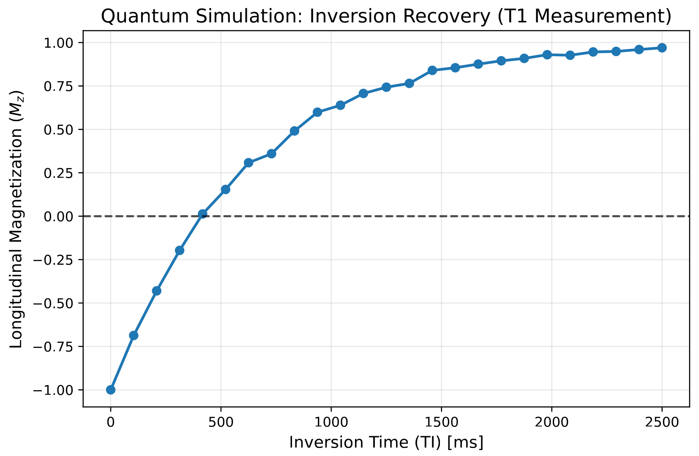
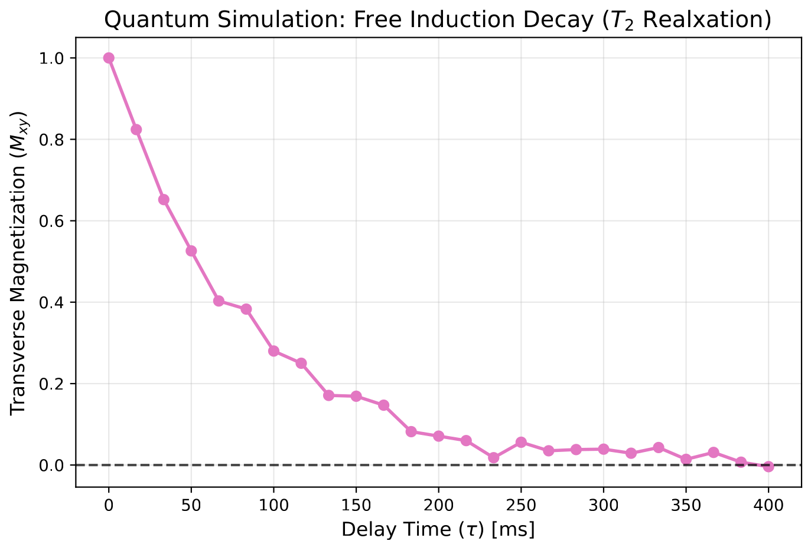

### 1. Thermal Equilibrium (Initialization)

In MRI, protons naturally align with the strong external magnetic field ($B_0$), creating a net longitudinal magnetization of $M_z = 1$ (normalized).

In our quantum circuit, this is represented by initializing the qubit in the ground state:


$$|\psi_0\rangle = |0\rangle$$


At this stage, the expectation value of the Pauli-Z operator (which corresponds to $M_z$) is fully positive:


$$\langle Z \rangle = \langle 0 | Z | 0 \rangle = 1$$

### 2. The 180° Inversion Pulse

To invert the magnetization, MRI applies a 180° Radio Frequency (RF) pulse along the x-axis. In Qiskit, this is identical to applying an $R_x(\pi)$ rotation gate. The matrix representation of this gate is:


$$R_x(\pi) = \begin{pmatrix} 0 & -i \\ -i & 0 \end{pmatrix}$$

Applying this to our initial state flips the spin (ignoring a global phase factor of $-i$ which has no physical consequence here):


$$R_x(\pi) |0\rangle = -i|1\rangle$$


Now, the simulated longitudinal magnetization is fully inverted:


$$\langle Z \rangle = \langle 1 | Z | 1 \rangle = -1$$

### 3. T1 Relaxation (Delay / Inversion Time)

During the delay period, Inversion Time ($TI$), the RF field is off. The protons exchange energy with their surrounding environment (spin-lattice relaxation) to return to thermal equilibrium.

Classically, this follows the solution to the Bloch equations for longitudinal recovery:


$$M_z(TI) = 1 - 2e^{-TI/T_1}$$

In the quantum simulation, unitary gates cannot model this because it is a non-reversible decoherence process. Instead, we model it as an Open Quantum System using an **Amplitude Damping Channel**. The noise model forces the state to probabilistically decay from $|1\rangle$ back to $|0\rangle$ as a function of the delay time $TI$ and the tissue's $T_1$ constant, perfectly mirroring the classical Bloch equation.

### 4. Measurement

Because quantum computers natively measure in the Z-basis (the computational basis), we do not need a 90° readout pulse to tip the spins into the transverse plane. We simply measure the system to find the probability of the qubit being in state $|0\rangle$ ($P(0)$) versus state $|1\rangle$ ($P(1)$).

The macroscopic magnetization $M_z$ at any given $TI$ is mathematically reconstructed from our shot counts:


$$\langle Z \rangle = P(0) - P(1)$$

This equation is what generates the discrete points you see plotted in the recovery curve, tracking precisely with the theoretical exponential function.

```
# Define MRI Tissue Parameters (e.g., White Matter at 1.5T)
t1_tissue = 600.0  
t2_tissue = 80.0   

# Simulate Inversion Recovery over various TI (Inversion Times)
ti_values = np.linspace(0, 2500, 25) # 0 to 2500 ms
mz_measurements = []

simulator = AerSimulator()

for ti in ti_values:
    # Update noise model for this specific delay time
    current_noise_model = NoiseModel()
    error = thermal_relaxation_error(t1_tissue, t2_tissue, ti)
    current_noise_model.add_all_qubit_quantum_error(error, "delay")
    
    # Build Inversion Recovery Circuit: 180° -> Delay(TI) -> Measure Z
    qc = QuantumCircuit(1, 1)
    qc.rx(np.pi, 0)            # 180 degree inversion pulse
    qc.delay(ti, 0, unit='ms') # Wait for TI
    qc.measure(0, 0)
    
    # Execute
    compiled_circuit = transpile(qc, simulator)
    result = simulator.run(compiled_circuit, noise_model=current_noise_model, shots=2000).result()
    counts = result.get_counts()
    
    # Calculate Mz (Expectation value of Z)
    p0 = counts.get('0', 0) / 2000
    p1 = counts.get('1', 0) / 2000
    mz = p0 - p1 
    mz_measurements.append(mz)
```
<center>

</center>

## Mathematical Translation of Transverse ($T_2$) Decay

To simulate $T_2$ spin-spin relaxation, we track how a coherent quantum superposition degrades into a mixed state due to environmental phase adjustments.

### 1. Excitation (The 90° Pulse)
We begin at thermal equilibrium ($|\psi_0\rangle = |0\rangle$). To measure transverse decay, we must move the magnetization vector into the $XY$ plane. We apply a $90^\circ$ rotation around the Y-axis ($R_y(\pi/2)$):

$$R_y(\pi/2) = \frac{1}{\sqrt{2}} \begin{pmatrix} 1 & -1 \\ 1 & 1 \end{pmatrix}$$

Applying this to our ground state yields an equal superposition state:
$$|\psi_1\rangle = R_y(\pi/2)|0\rangle = \frac{|0\rangle + |1\rangle}{\sqrt{2}}$$

On the Bloch Sphere, this vector points directly along the positive $X$-axis. The expectation value of the transverse magnetization is at its maximum:
$$\langle X \rangle = 1, \quad \langle Z \rangle = 0$$

### 2. $T_2$ Dephasing (The Delay Channel)
During the delay period ($\tau$), the environment causes the spins to lose phase coherence. Mathematically, this is modeled as a **Phase Damping Channel**. 

As time progresses, the off-diagonal elements of the system's density matrix $\rho$ decay exponentially at a rate governed by $T_2$:
$$\rho(\tau) = \frac{1}{2} \begin{pmatrix} 1 & e^{-\tau/T_2} \\ e^{-\tau/T_2} & 1 \end{pmatrix}$$

As $\tau \rightarrow \infty$, the off-diagonal terms vanish completely, leaving a completely mixed state ($\rho = \frac{1}{2}I$). The spins are completely out of phase, meaning net transverse magnetization $M_{xy}$ has dropped to 0.

### 3. The Transverse Readout Gate
Because a quantum computer can only collapse and measure states along the longitudinal $Z$-axis, we cannot read $\langle X \rangle$ directly. 

To map the remaining $X$-axis coherence back into measurable $Z$-axis population differences, we apply a reverse rotation gate, $R_y(-\pi/2)$, just before measurement:

* **If no decay occurred ($\tau = 0$):** 
  $$R_y(-\pi/2) \left( \frac{|0\rangle + |1\rangle}{\sqrt{2}} \right) = |0\rangle \implies \langle Z \rangle = 1$$
* **If total dephasing occurred ($\tau = \infty$):** 
  The state is a completely mixed identity matrix $\frac{1}{2}I$. Applying any unitary rotation to an identity matrix leaves it unchanged. Measuring it results in a strict 50/50 split of $|0\rangle$ and $|1\rangle$:
  $$\langle Z \rangle = 0.5 - 0.5 = 0$$

Thus, by tracking $\langle Z \rangle$ after the reverse rotation, we perfectly reconstruct the classical transverse decay curve described by the Bloch equation:
$$M_{xy}(\tau) = M_0 e^{-\tau/T_2}$$

<center>

</center>
